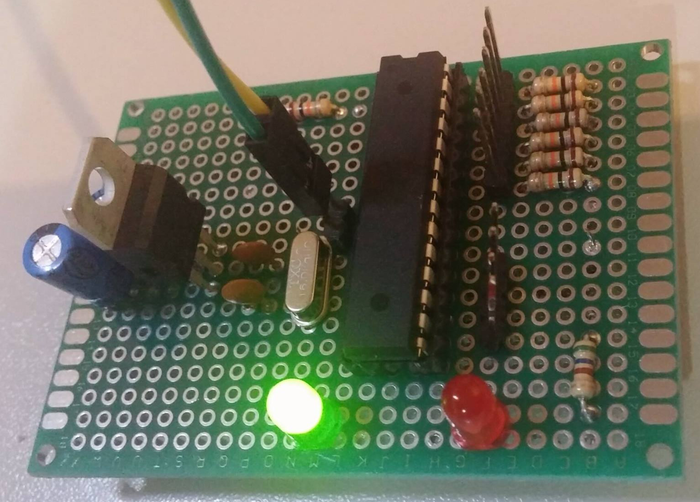
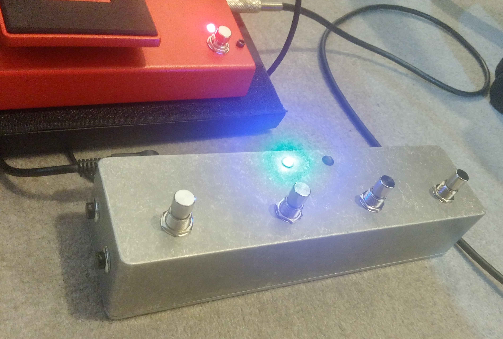
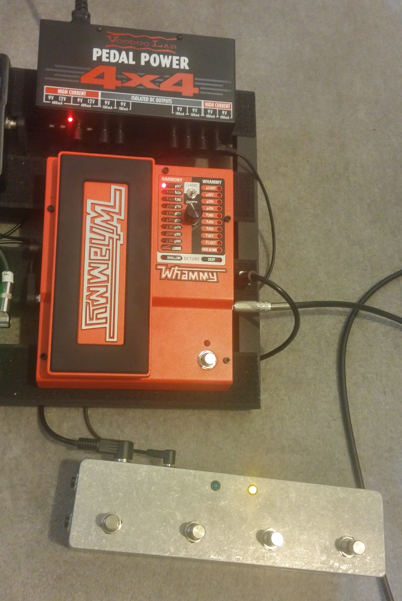

# whammy-midi
MIDI controller for the Digitech Whammy

- Navigate through all modes with 2 side buttons
- Save up to 4 presets
- LEDs indicate classic/chords mode
- Enable/bypass the effect by pressing again
- Simple circuit layout
- Standard 9V center negative connector

The programming was done on an Arduino Uno and implemented on an Atmel AVR ATMega 88A @ 2Mhz 
Vidéo demo available at https://www.youtube.com/watch?v=AqI-VZF9RrA 

